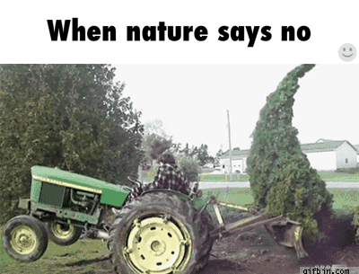
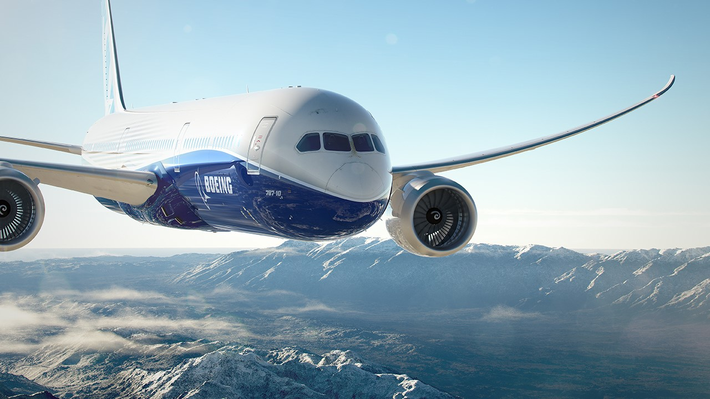
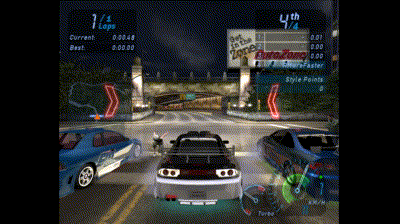

**Força a todos aqueles que precisam dela diante de tudo o que estamos passando, principalmente a todas as famílias que perderam seus entes queridos. Agradecimentos a todos os profissionais envolvidos, os quais lutam e dão suporte a cada enfermo.**

# Hi, guys! :dog: (Some dogs will turn into foxes)

### Corn :corn:, tomatoes :tomato: and a lot of contour plot :infinity:
Como sugere a *sidebar* à esquerda - para você que está na *web* - ou a *topbar* - caro usuário mobile - estou cursando essa engenharia que cada vez mais me surpreende. Alguns semestres ainda estão pela frente, e como se diz no ditado, muitas águas vão rolar.

    

### Beginning hour :hourglass:
Bem vindos ao meu repositório no GitHub. Aqui eu compartilho diversas das minhas experiências durante a graduação, desde programas em python me inserindo na disciplina de algoritmos, softwares de computação simbólica e manipulação de gráficos como o Mathematica, análise de estruturas com o Ansys, até desenvolvimento web usando Node, React e por aí vai. Muitas delas são dignas de maior explicação com a adição de READMEs como este, mas o volume de tarefas ainda não permitiu. Aos poucos as coisas vão se ajustando. :stuck_out_tongue_winking_eye:

    

### :watch::red_circle::airplane::green_circle: Oscar Lima Alpha
* Se quiser bater um papo sobre músicas, aviões, relógios, carros, microcontroladores e coisas do tipo (totalmente interligadas) me chama no [insta]() ou me siga por lá simplesmente! :smiley:
## Ãaaãhhh!! :zombie_man::zombie_woman:
* Nem queira falar de Resident Evil, sem comentários para Capcom :heart: (*Observação: Algumas versões eu ainda não joguei (jogadas: 1 hd, 4, 6, 7, 2 remake), mas o contato com os remakes e remasters via YouTube ajudaram a perceber o quão boa é a franquia, com algumas ressalvas é claro.*) :grinning: 

    

* Se topar uma partida de Dirt Rally estamos aí... um pouco de poeira, cascalho, lama e nuances de asfalto geralmente faz bem! Ou quem sabe um Forza ou Need for Speed das antigas... :racing_car:
